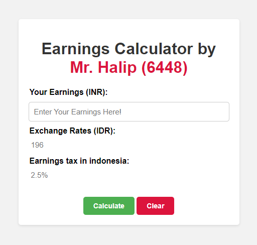

# BrightCHAMPS Teacher's Earnings Calculator

This project is a simple earnings calculator for teachers at BrightCHAMPS, implemented using HTML, CSS, and JavaScript.

## Preview



## Table of Contents

- Introduction
- Features
- Usage
- Files
- Meta Data
- License

## Introduction

The BrightCHAMPS Teacher's Earnings Calculator allows teachers to calculate their earnings in INR and convert them to IDR, considering the earnings tax in Indonesia.

## Features

- Input fields for earnings in INR.
- Display of exchange rates in IDR.
- Display of earnings tax in Indonesia.
- Buttons to calculate and clear the fields.

## Usage

1. Clone the repository:

   ```bash
   git clone https://github.com/Halip26/earnings-calculator.git
   cd earnings-calculator
